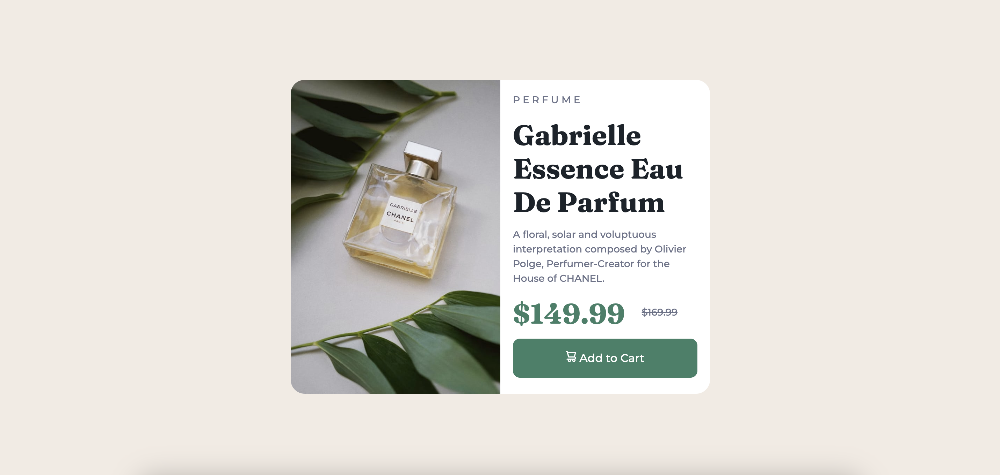

# Frontend Mentor - Product preview card component solution

This is a solution to the [Product preview card component challenge on Frontend Mentor](https://www.frontendmentor.io/challenges/product-preview-card-component-GO7UmttRfa). Frontend Mentor challenges help you improve your coding skills by building realistic projects. 

## Table of contents

- [Overview](#overview)
  - [Screenshot](#screenshot)
  - [Links](#links)
- [My process](#my-process)
  - [Built with](#built-with)
  - [What I learned](#what-i-learned)
  - [Useful resources](#useful-resources)
- [Author](#author)

**Note: Delete this note and update the table of contents based on what sections you keep.**

## Overview

### The challenge

Users should be able to:

- View the optimal layout depending on their device's screen size
- See hover and focus states for interactive elements

### Screenshot

### Links

- Solution URL: [Frontend Mentor](https://www.frontendmentor.io/solutions/product-preview-card-component-with-bootstrap-GraUDjePi2)
- Live Site URL: [Netlify](https://eloquent-mousse-91a228.netlify.app)

## My process

### Built with

- Semantic HTML5 markup
- CSS custom properties
- Flexbox
- CSS Grid
- Mobile-first workflow
- [Sass](https://sass-lang.com/) - Sass
- [Boostrap](https://getbootstrap.com/) - Boostrap

### What I learned

I definitely struggled the most with fixing the images for both mobile and desktop. In the end, I just decided to "display:none" and "display:block" using media queries.

### Useful resources

- [Display:none vs. Visibility:hidden (in spanish)](https://cybmeta.com/display-none-vs-visibility-hidden-y-tu-como-escondes-las-cosas) - This helped me with the images for mobile/desktop.

## Author

- LinkedIn - [Jessica Arvizu](https://www.linkedin.com/in/jessica-arvizu/)
- Frontend Mentor - [@jessicaArvizu](https://www.frontendmentor.io/profile/jessicaArvizu)
